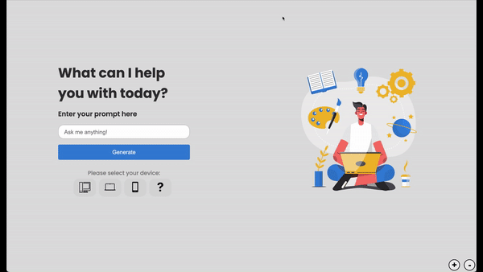

# Demo

# Inspiration
As computer science students, we are frequently approached by our older family members seeking help with their technology-related issues. Despite our initial assumption that Google could easily solve their problems, we realized that the search engine's results can be overwhelming and confusing for those less comfortable with new technology. The incessant ads, links to irrelevant sites, and excessive noise made it increasingly difficult for them to find the answers they needed. Our project was born out of this realization, with the goal of creating an accessible and user-friendly solution to help individuals struggling with new technology quickly and easily find solutions to their queries.

Additionally, we recognize that older individuals face unique challenges as technology continues to advance at a rapid pace. Keeping up with new features and tools can be overwhelming, leaving many feeling frustrated and helpless. Our project aims to provide a simple and effective solution to bridge this gap, empowering users of all ages to confidently navigate and conquer the world of technology.

# What it does
STPR.AI utilizes a seamless process, prompting users for three essential pieces of information: their specific inquiry, the device in question, and the corresponding operating system. This vital data is then analyzed by the website, which leverages the powerful OpenAI API to generate a comprehensive list of straightforward and actionable steps. The resulting response is then seamlessly presented on the webpage, providing users with an easy-to-follow guide towards resolving their technology concerns.

# How we built it
Our project was developed using a streamlined technology stack, including HTML, CSS, JavaScript, and node.js for the backend. To ensure the utmost safety and security for our users, we also integrated two essential APIs: OpenAI, which provides robust natural language processing capabilities, and DOMPurify, a tool used for input sanitization to mitigate potential vulnerabilities on the website.

# Challenges we ran into
During the development of our website, we encountered numerous challenges with the layout and design. Despite our limited CSS expertise, we remained committed to crafting a visually stunning and engaging user experience. However, this aspiration came with a steep learning curve, resulting in some early missteps, such as defining all elements in pixels instead of scalable units like em or rem. Nevertheless, we remained undeterred and persevered, ultimately delivering a website that both looks and functions beautifully.

# Accomplishments that we're proud of
Our team takes great pride in the stunning visuals of our website. The meticulously crafted animations imbue the site with a polished, refined feel, elevating the overall user experience to new heights of interactivity and enjoyment. We are thrilled to have delivered a website that is not only functional but also engaging and visually appealing.

# What's next for STPR.AI
As we look to the future, our team is focused on enhancing the accessibility and functionality of our website to reach an even broader audience. While we are immensely satisfied with the current desktop version, we are dedicated to improving the mobile experience through additional CSS development, ensuring seamless scalability across all devices. Furthermore, we aim to cater to the specific needs of older users by incorporating user-accessible features like adjustable font sizes (which is already implemented). In the long term, we hope to expand our feature set even further, incorporating high-contrast mode and text-to-speech capabilities, further solidifying our commitment to making our website inclusive and user-friendly for everyone.
